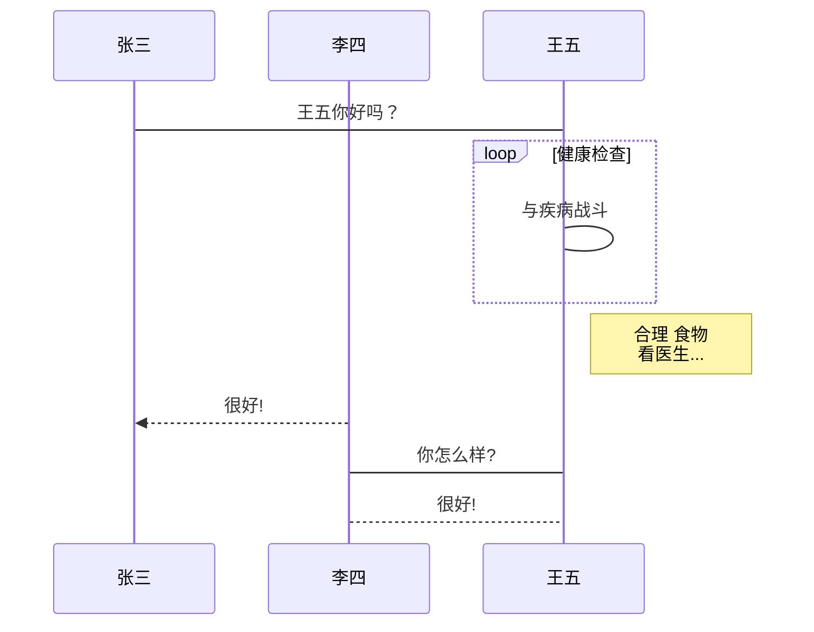

# XX大全

# 一级标题
## 二级标题
### 三级标题
#### 四级标题
##### 五级标题
###### 六级标题
段落1（后面要有2个空格）  
段落2  
段落3  
*斜体文本*
_斜体文本_
**粗体文本**
__粗体文本__
***粗斜体文本***
___粗斜体文本___

***
* * *
***** *
---
- - -
-- - --- - -
___ __
~~删除线~~
<u>下划线</u>
未读数[^1]

* 第一项
* 第二项
* 第三项

+ 第一项
+ 第二项
+ 第三项


- 第一项
- 第二项
- 第三项

1. 第一项
2. 第二项
3. 第三项
4. 第四项
1. 第一项：
    - 第一项嵌套的第一个元素
    - 第一项嵌套的第二个元素
2. 第二项：
    - 第二项嵌套的第一个元素
    - 第二项嵌套的第二个元素

> 区块引用  
> 菜鸟教程  
> 学的不仅是技术更是梦想  

> 最外层
> > 第一层嵌套
> > > 第二层嵌套

> 区块中使用列表
> 1. 第一项
> 2. 第二项
> + 第一项
> + 第二项
> + 第三项

* 第一项
    > 菜鸟教程
    > 学的不仅是技术更是梦想
* 第二项

```javascript
$(document).ready(function () {
    alert('RUNOOB');
});
```
```c++
int main(int argc, char** argv) {
    return 0;
}
```

这是一个链接 [百度](https://www.baidu.com)


|  表头   | 表头  |
|  ----  | ----  |
| 单元格  | 单元格 |
| 单元格  | 单元格 |

| 左对齐 | 右对齐 | 居中对齐 |
| :-----| ----: | :----: |
| 单元格 | 单元格 | 单元格 |
| 单元格 | 单元格 | 单元格 |

```sequence
对象A->对象B: 对象B你好吗?（请求）
Note right of 对象B: 对象B的描述
Note left of 对象A: 对象A的描述(提示)
对象B-->对象A: 我很好(响应)
对象A->对象B: 你真的好吗？
```

```sequence
Title: 标题：复杂使用
对象A->对象B: 对象B你好吗?（请求）
Note right of 对象B: 对象B的描述
Note left of 对象A: 对象A的描述(提示)
对象B-->对象A: 我很好(响应)
对象B->小三: 你好吗
小三-->>对象A: 对象B找我了
对象A->对象B: 你真的好吗？
Note over 小三,对象B: 我们是朋友
participant C
Note right of C: 没人陪我玩
```



# docker
> 1.检查docker程序运行状态
```
docker info
```
> 2.查找Docker Hub公共可用镜像
```
docker search nginx
```

> 3.从Docker Hub拉取镜像
```
docker pull ubuntu/nginx
```

> 4.列出docker主机本地镜像
```
docker images
```
