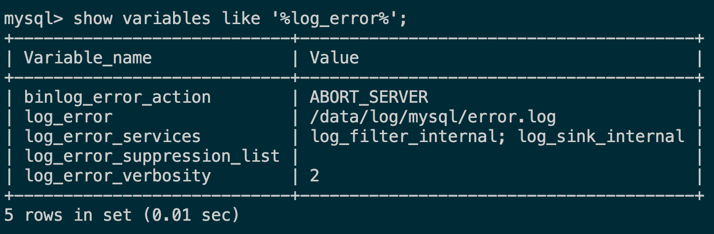

# XX大全

# 一级标题
## 二级标题
### 三级标题
#### 四级标题
##### 五级标题
###### 六级标题
段落1（后面要有2个空格）  
段落2  
段落3  
*斜体文本*
_斜体文本_
**粗体文本**
__粗体文本__
***粗斜体文本***
___粗斜体文本___

***
* * *
***** *
---
- - -
-- - --- - -
___ __
~~删除线~~
<u>下划线</u>
未读数[^1]

* 第一项
* 第二项
* 第三项

+ 第一项
+ 第二项
+ 第三项


- 第一项
- 第二项
- 第三项

1. 第一项
2. 第二项
3. 第三项
4. 第四项
1. 第一项：
    - 第一项嵌套的第一个元素
    - 第一项嵌套的第二个元素
2. 第二项：
    - 第二项嵌套的第一个元素
    - 第二项嵌套的第二个元素

> 区块引用  
> 菜鸟教程  
> 学的不仅是技术更是梦想  

> 最外层
> > 第一层嵌套
> > > 第二层嵌套

> 区块中使用列表
> 1. 第一项
> 2. 第二项
> + 第一项
> + 第二项
> + 第三项

* 第一项
    > 菜鸟教程
    > 学的不仅是技术更是梦想
* 第二项

```javascript
$(document).ready(function () {
    alert('RUNOOB');
});
```
```c++
int main(int argc, char** argv) {
    return 0;
}
```

这是一个链接 [百度](https://www.baidu.com)


|  表头   | 表头  |
|  ----  | ----  |
| 单元格  | 单元格 |
| 单元格  | 单元格 |

| 左对齐 | 右对齐 | 居中对齐 |
| :-----| ----: | :----: |
| 单元格 | 单元格 | 单元格 |
| 单元格 | 单元格 | 单元格 |

```sequence
对象A->对象B: 对象B你好吗?（请求）
Note right of 对象B: 对象B的描述
Note left of 对象A: 对象A的描述(提示)
对象B-->对象A: 我很好(响应)
对象A->对象B: 你真的好吗？
```

```sequence
Title: 标题：复杂使用
对象A->对象B: 对象B你好吗?（请求）
Note right of 对象B: 对象B的描述
Note left of 对象A: 对象A的描述(提示)
对象B-->对象A: 我很好(响应)
对象B->小三: 你好吗
小三-->>对象A: 对象B找我了
对象A->对象B: 你真的好吗？
Note over 小三,对象B: 我们是朋友
participant C
Note right of C: 没人陪我玩
```


# docker
> 1.检查docker程序运行状态
```
docker info
```
> 2.查找Docker Hub公共可用镜像
```
docker search nginx
```

> 3.从Docker Hub拉取镜像
```
docker pull ubuntu/nginx
```

> 4.列出docker主机本地镜像
```
docker images
```


# Linux安装MySQL指引
## 本指引以MySQL Community Server 8.0.28版本为示例说明
1. 从官网下载 [MySQL Community Server 8.0.28](https://dev.mysql.com/downloads/mysql/)


2. 规划服务器安装路径  
> 安装包存放位置：/data/software  
> MySQL安装位置：/usr/local/mysql  
> 数据库保存位置：/data/mysql  
> 日志保存位置：/data/log/mysql  

把下载好的mysql-8.0.28-linux-glibc2.12-x86_64.tar包上传到服务/data/software目录下

3. 解压压缩包到安装位置  
```shell
mkdir -p /usr/local/mysql && cd /data/software

tar -xvf mysql-8.0.28-linux-glibc2.12-x86_64.tar && tar -xvf mysql-8.0.28-linux-glibc2.12-x86_64.tar.xz -C /usr/local/mysql --strip-components 1
```

4. 创建数据库及日志目录
```shell
mkdir -p /data/mysql && mkdir -p /data/log/mysql
```

5. 创建mysql用户、组及指定登录目录
```shell
groupadd mysql

useradd -r -s /sbin/nologin -g mysql mysql -d /usr/local/mysql
```

6. 更改相关目录所有者
```shell
cd /usr/local/mysql
chown -R mysql . && chgrp -R mysql .

cd /data/mysql
chown -R mysql . && chgrp -R mysql .

cd /data/log/mysql
chown -R mysql . && chgrp -R mysql .

```

7. 执行初始化
```shell
cd /usr/local/mysql

bin/mysqld --initialize --user=mysql --basedir=/usr/local/mysql --datadir=/data/mysql
```


8. 配置mysql
```shell
cd /usr/local/mysql/support-files

touch my-default.cnf
cp -a ./my-default.cnf /etc/my.cnf
```
编辑/etc/my.cnf文件，输入如下内容：
```text
[client]
port=3306
socket=/tmp/mysql.sock

[mysqld]
port=3306
user=mysql
socket=/tmp/mysql.sock
basedir=/usr/local/mysql
datadir=/data/mysql
```

9. 把mysql添加到系统服务  
```shell
cd /usr/local/mysql/support-files

cp -a ./mysql.server /etc/init.d/mysql
chmod +x /etc/init.d/mysql
chkconfig --add mysql
chkconfig --list mysql
```

10. 启动服务  
```shell
service mysql start
service mysql status # 查看服务运行状态
```


11. root账号登录（使用初始密码）
```shell
mysql -uroot -p
```

提示必须重置密码

12. 修改root账号密码及权限
```shell
alter user 'root'@'localhost' identified by 'abc123';
flush privileges;
```

13. 创建新账号allanchen及授予权限
```shell
create user 'allanchen'@'localhost' identified by 'abc123';
update mysql.user set host='%' where user='allanchen';
grant all privileges on *.* to allanchen@'%' with grant option;
flush privileges;

mysql -uallanchen -pabc123 # allanchen账号登录
```

14. 停止服务
```shell
service mysql stop
```


15. 日志
    - 全量日志
    ```mysql
    show variables like '%general%';
    ```
    
    ***不建议开启，消耗性能并且占用空间***
    - 错误日志
    ```mysql
    show variables like '%log_error%';
    ```
    
    - 慢查询日志
    ```mysql
    show variables like '%slow_query%';
    show variables like '%long_query_time%'; # 慢查询时间阈值
    ```
    
    - 二进制日志文件（binary log）
    ```mysql
    show variables like '%log_bin%';
    ```
    可自定义配置日志文件路径，编辑/etc/my.cnf，新增如下内容：
    ```text
    general_log=off
    general-log-file=/data/log/mysql/general.log

    log-error=/data/log/mysql/error.log

    slow_query_log=on
    slow-query-log-file=/data/log/mysql/slow.log
    ```
    ***重启如果失败，可尝试创建相关的日志文件及修改权限（步骤6）***

16. 优化配置  
可以通过下述命令查看所有配置项：
```mysql
show global variables; # 或者
show global variables where variable_name='xxx';
```
如果要变更值的话，编辑/etc/my.cnf添加相应的配置项即可
